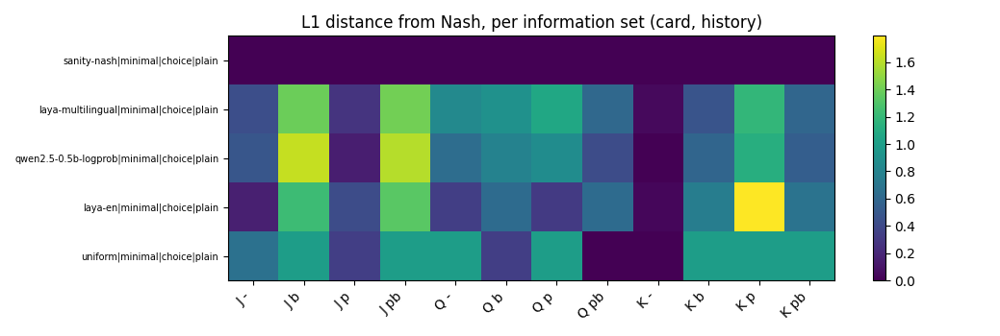
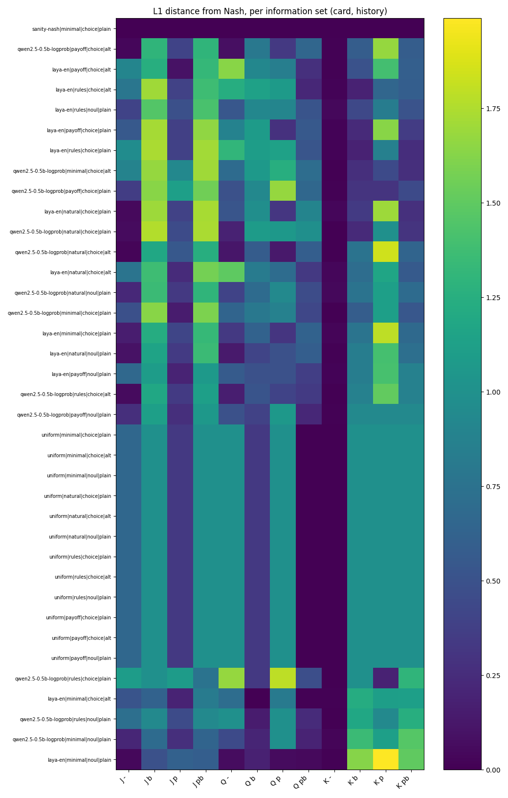

# I let two small models play Kuhn poker and neither one has a clue

I've had a Kuhn poker lab sitting around for a while with a closed-form Nash bot, a CFR bot and a few heuristic bots in it (the first write-up is [REPORT.md](REPORT.md)), and when I found out about a new family of "typed decision models" I wanted to know the obvious thing, which is whether you can hand one of them a poker hand in plain text, ask "do you check or bet?", and get anything resembling good play back. This post covers rungs 0 and 1 of the plan in the [arena spec](superpowers/specs/2026-10-03-decision-model-arena-design.md), meaning no training at all, only prompting. Rung 2 (fine-tuning) is not done here.

## What's being tested

Three models plus the classical opponents, all playing through the same adapter:

- **laya-en**: Laya from convaiinnovations (`convaiinnovations/laya`, 421M parameters, Apache-2.0), a ModernBERT-large based model built to answer typed questions about a state like "choice" (pick a label) or "noul" (a yes/no probability). I also ran the multilingual checkpoint (`laya-multilingual`, 322M) but only at rung 0.
- **qwen2.5-0.5b-logprob**: `Qwen/Qwen2.5-0.5B-Instruct`, a generic small LLM that has nothing to do with Jev, where I read the next-token log-probabilities of the answer labels. It's the "is Laya actually doing anything special" control.
- **uniform**: 50/50 over the two labels no matter what it's shown. It ignores the prompt entirely, which makes it a useful floor.
- **Nash** (the closed-form equilibrium at alpha = 0) and **CFR** (50,000 iterations of self-play, seed 0) are the opponents in the head-to-head, and Nash is also the yardstick for exploitability.

Kuhn poker is a good eval for this because the game is tiny enough to solve exactly. There are only 12 information sets (your card, one of Jack/Queen/King, crossed with the 4 betting histories where you have to act), so a model's whole "strategy" is 12 probabilities, and from those I can compute the **exact exploitability** with a full best-response traversal, no sampling. 0 means the strategy is an equilibrium and nothing can beat it by more than the game's built-in edge, and the numbers go up from there. I also play the models against Nash and CFR for 20,000 hands per matchup per seat for the sampled version (95% bootstrap CIs).

To turn a model into a bot, each information set is converted to text by one of 4 **encoders** (`minimal`: `card=Jack history=-`, `natural`: "You hold the Jack. Situation: the opponent bet 1 chip.", `rules`: the rules paragraph plus natural, `payoff`: natural plus the pot size and cost to continue), then paired with a question (`choice` with plain labels check/bet and fold/call, `choice` with alt labels wait/raise and give up/match, or `noul` "Should you bet?" / "Should you call?" read as P(yes)). The model's label probabilities become the bot's action distribution. Rung 0 is a single setup (minimal / choice / plain), rung 1 is the full grid of 3 models x 4 encoders x 3 question setups, 36 contenders.

Before trusting any model number I pushed the Nash probabilities themselves through the entire pipeline (encoder, question, scorer, bot) as a `sanity-nash` contender, and it lands at an exploitability of ~9e-17 in both rungs, and `uniform` scores exactly 0.4583 on all 12 variants since it ignores them, so the adapter and the harness are doing what they should.

## Rung 0: zero-shot, one prompt

| rank | config | exploitability | total L1 from Nash | nearest alpha |
|---|---|---|---|---|
| 1 | sanity-nash\|minimal\|choice\|plain | 0.0000 | 0.000 | 0.000 |
| 2 | laya-multilingual\|minimal\|choice\|plain | 0.3334 | 9.231 | 0.078 |
| 3 | qwen2.5-0.5b-logprob\|minimal\|choice\|plain | 0.3581 | 8.850 | 0.108 |
| 4 | laya-en\|minimal\|choice\|plain | 0.3581 | 8.297 | 0.039 |
| 5 | uniform\|minimal\|choice\|plain | 0.4583 | 8.333 | 0.167 |

That's the minimal prompt with plain labels and nothing else. Laya-multilingual comes first among the real models at 0.3334, then laya-en and qwen basically tied at 0.3581 (0.35814 vs 0.35809 if you go to more digits, I wouldn't read anything into that), and all of them beat uniform's 0.4583 but are nowhere near 0. Total L1 from Nash, the other column, barely separates them from uniform at all (8.3 for laya-en, 8.85 for qwen, 8.33 for uniform), which is the first hint that "less exploitable" and "closer to Nash" aren't the same thing here.

## Rung 1: same models, many ways to ask

| rank | config | exploitability | total L1 from Nash | nearest alpha |
|---|---|---|---|---|
| 1 | sanity-nash\|minimal\|choice\|plain | 0.0000 | 0.000 | 0.000 |
| 2 | qwen2.5-0.5b-logprob\|payoff\|choice\|alt | 0.3144 | 7.761 | 0.020 |
| 3 | laya-en\|payoff\|choice\|alt | 0.3152 | 9.758 | 0.245 |
| 4 | laya-en\|rules\|choice\|alt | 0.3169 | 9.389 | 0.235 |
| 5 | laya-en\|rules\|noul\|plain | 0.3172 | 8.462 | 0.108 |
| 6 | laya-en\|payoff\|choice\|plain | 0.3232 | 9.379 | 0.225 |
| 7 | laya-en\|rules\|choice\|plain | 0.3242 | 10.230 | 0.245 |
| 8 | qwen2.5-0.5b-logprob\|minimal\|choice\|alt | 0.3271 | 9.901 | 0.176 |
| 9 | qwen2.5-0.5b-logprob\|payoff\|choice\|plain | 0.3307 | 9.475 | 0.088 |
| 10 | laya-en\|natural\|choice\|plain | 0.3336 | 8.930 | 0.088 |
| 11 | qwen2.5-0.5b-logprob\|natural\|choice\|plain | 0.3352 | 8.885 | 0.039 |
| 12 | qwen2.5-0.5b-logprob\|natural\|choice\|alt | 0.3384 | 7.682 | 0.020 |
| 13 | laya-en\|natural\|choice\|alt | 0.3486 | 9.788 | 0.255 |
| 14 | qwen2.5-0.5b-logprob\|natural\|noul\|plain | 0.3576 | 8.330 | 0.088 |
| 15 | qwen2.5-0.5b-logprob\|minimal\|choice\|plain | 0.3581 | 8.850 | 0.108 |
| 16 | laya-en\|minimal\|choice\|plain | 0.3581 | 8.297 | 0.039 |
| 17 | laya-en\|natural\|noul\|plain | 0.4031 | 7.565 | 0.020 |
| 18 | laya-en\|payoff\|noul\|plain | 0.4070 | 8.098 | 0.108 |
| 19 | qwen2.5-0.5b-logprob\|rules\|choice\|alt | 0.4363 | 7.405 | 0.029 |
| 20 | qwen2.5-0.5b-logprob\|payoff\|noul\|plain | 0.4520 | 7.715 | 0.088 |
| 21 | uniform\|minimal\|choice\|plain | 0.4583 | 8.333 | 0.167 |
| 22 | uniform\|minimal\|choice\|alt | 0.4583 | 8.333 | 0.167 |
| 23 | uniform\|minimal\|noul\|plain | 0.4583 | 8.333 | 0.167 |
| 24 | uniform\|natural\|choice\|plain | 0.4583 | 8.333 | 0.167 |
| 25 | uniform\|natural\|choice\|alt | 0.4583 | 8.333 | 0.167 |
| 26 | uniform\|natural\|noul\|plain | 0.4583 | 8.333 | 0.167 |
| 27 | uniform\|rules\|choice\|plain | 0.4583 | 8.333 | 0.167 |
| 28 | uniform\|rules\|choice\|alt | 0.4583 | 8.333 | 0.167 |
| 29 | uniform\|rules\|noul\|plain | 0.4583 | 8.333 | 0.167 |
| 30 | uniform\|payoff\|choice\|plain | 0.4583 | 8.333 | 0.167 |
| 31 | uniform\|payoff\|choice\|alt | 0.4583 | 8.333 | 0.167 |
| 32 | uniform\|payoff\|noul\|plain | 0.4583 | 8.333 | 0.167 |
| 33 | qwen2.5-0.5b-logprob\|rules\|choice\|plain | 0.5033 | 10.719 | 0.284 |
| 34 | laya-en\|minimal\|choice\|alt | 0.5525 | 7.196 | 0.127 |
| 35 | qwen2.5-0.5b-logprob\|rules\|noul\|plain | 0.5714 | 8.823 | 0.167 |
| 36 | qwen2.5-0.5b-logprob\|minimal\|noul\|plain | 0.6744 | 7.640 | 0.059 |
| 37 | laya-en\|minimal\|noul\|plain | 0.7716 | 7.224 | 0.010 |

(The `\|` in the config cells are escaped pipes, config names are `model|encoder|question|labels`.)

My favourite part of this table is how wide it is. The best configs, qwen payoff/choice/alt at 0.3144 and laya-en payoff/choice/alt at 0.3152, sit about 31% below uniform's 0.4583 (I computed that as (0.4583 - 0.3144) / 0.4583), and the worst, laya-en minimal/noul at 0.7716, is well *over* uniform. Of the 24 laya-en and qwen configs, 19 beat uniform and **5 are worse than a coin flip**: laya-en minimal/choice/alt (0.5525) and minimal/noul (0.7716), plus qwen rules/choice/plain (0.5033), rules/noul (0.5714) and minimal/noul (0.6744). Same weights, same game, and just by rephrasing the question a model goes from "kind of reasonable" to "actively misleading".

### Zero-shot against prompt variants

Laya's zero-shot (rung 0) number is 0.3581, and across its 12 rung 1 variants the range is 0.3152 to 0.7716, so prompting moved its exploitability by 0.043 on the good end and made it far worse on the bad end. Qwen goes from 0.3581 zero-shot to a range of 0.3144 to 0.6744. So a better prompt buys a little, a bad prompt costs a lot, and there's no variant anywhere near Nash.

Digging into what moves it, using the model x encoder x question pairs from the summary:

- **Question type**: with plain labels, `noul` is worse than `choice` in 7 of the 8 model/encoder pairs. The one exception is laya-en with the rules encoder, 0.3172 for noul vs 0.3242 for choice. The biggest gaps are on the minimal prompt, where laya-en goes from 0.3581 (choice) to 0.7716 (noul) and qwen from 0.3581 to 0.6744.
- **Label wording**: alt labels (wait/raise, give up/match) beat plain in 5 of 8 choice pairs and lose in 3, so no consistent direction. For laya-en on the minimal prompt it is 0.3581 plain vs 0.5525 alt, a big loss, while for qwen on minimal it flips to 0.3581 plain vs 0.3271 alt, a win, and qwen on rules improves from 0.5033 to 0.4363. Renaming "bet" to "raise" shouldn't change what a poker player would do, and it moves these models a lot.
- **Encoder**: averaging each model's three setups per encoder, laya-en likes rules best (0.3194) and minimal worst (0.5607), while qwen likes natural best (0.3437) and rules worst (0.5037). The same extra rules paragraph is the best thing for one model and the worst for the other.

Verdict: prompt format is a bigger lever than which model you picked, and the effect isn't portable between models, so every number here belongs to its exact prompt.

## Where do they go wrong

Each cell is the L1 distance between a contender's action distribution and Nash at one information set (columns are your card then the history: `-` is you act first, `p` the opponent checked, `b` the opponent bet, `pb` you checked and they bet). One caveat on reading it: the Nash it's compared to is the *nearest* member of the equilibrium family for each contender, which lets the fitted alpha soak up some error at J `-`, K `-` and Q `pb`, so the near-zero K `-` column (mean distance 0.016 across the 24 laya/qwen contenders) isn't as impressive as it looks.

The pattern I trust is in the other columns. For these information sets Nash plays the same way for every alpha (Jack facing a bet always folds, King facing a bet always calls, King after a check always bets), so the L1 distance converts straight into a probability (distance / 2 for the fold-always cases, 1 - distance / 2 for the bet-always cases). Averaged over the 24 laya-en and qwen contenders (an ad-hoc computation from `infoset_distance.csv`):

| situation | Nash | mean model probability |
|---|---|---|
| Jack facing a bet, P(call) | 0 | 0.647 |
| King facing a bet, P(call) | 1 | 0.651 |
| Jack, checked then bet into, P(call) | 0 | 0.644 |
| King, checked then bet into, P(call) | 1 | 0.638 |
| King after a check, P(bet) | 1 | 0.413 |

The models call with a Jack about as often as they call with a King. The most wrong infosets on average are J `b` and J `pb` (mean L1 1.293 and 1.289 out of a possible 2) and K `p` (1.174), and the most consistent thing about them is that **they largely ignore the card**. Only 13 of the 24 contenders call more with the King than with the Jack facing a bet, which is barely better than a coin flip. Checking that directly for Laya with `scripts/check_laya_choice_vs_noul.py` (output reproduced from my run, minimal prompt): when it acts first its bet probability is 0.12 / 0.17 / 0.10 for Jack / Queen / King, and when facing a bet its call probability is 0.62 / 0.65 / 0.62. It reacts to "is there a bet pending" and basically nothing else. With the natural prompt it is a bit more expressive (0.11 / 0.26 / 0.25 when acting first, 0.85 / 0.82 / 0.83 facing a bet) but still not monotonic in card strength, and Nash would never call with that Jack.

That script also answers a question I had about `noul`, whether reading its P(yes) as "should I bet/call" is even right. With the natural prompt, noul P(yes) and choice P(bet) land on the same side of 0.5 in 12 of 12 information sets, so it's the right reading there. On the minimal prompt it's 6 of 12, because noul's P(yes) sits below 0.5 almost everywhere , though it still goes up when a bet is pending (0.19 to 0.32 facing a bet vs 0.01 to 0.03 when not), so the signal points the same way and the scale doesn't.

## Head-to-head

Exploitability is the exact number, so this table is the sampled sanity check, with the contender's average payoff per hand and a 95% CI (20,000 hands per matchup per seat).

| contender | vs Nash, as P1 | vs Nash, as P2 | vs CFR, as P1 | vs CFR, as P2 |
|---|---|---|---|---|
| sanity-nash (Nash pushed through the pipeline) | -0.064 [-0.081, -0.048] | +0.064 [+0.048, +0.081] | -0.064 [-0.081, -0.048] | +0.062 [+0.045, +0.079] |
| uniform | -0.183 [-0.203, -0.165] | -0.045 [-0.063, -0.028] | -0.183 [-0.203, -0.164] | -0.111 [-0.129, -0.091] |
| qwen, payoff / choice / alt (best exploitability) | -0.226 [-0.245, -0.207] | -0.006 [-0.021, +0.009] | -0.226 [-0.245, -0.207] | -0.098 [-0.115, -0.081] |
| laya-en, payoff / choice / alt | -0.153 [-0.174, -0.132] | -0.042 [-0.057, -0.025] | -0.153 [-0.174, -0.132] | -0.099 [-0.117, -0.080] |
| laya-en, minimal / choice / plain (zero-shot) | -0.221 [-0.240, -0.200] | -0.009 [-0.024, +0.005] | -0.221 [-0.240, -0.200] | -0.100 [-0.117, -0.083] |
| laya-en, minimal / noul / plain (worst) | -0.236 [-0.252, -0.219] | -0.007 [-0.021, +0.007] | -0.236 [-0.252, -0.219] | -0.119 [-0.133, -0.103] |
| laya-multilingual, minimal / choice / plain (rung 0) | -0.213 [-0.232, -0.192] | -0.053 [-0.070, -0.035] | -0.213 [-0.232, -0.192] | -0.115 [-0.134, -0.096] |

The game isn't symmetric, so the right baseline depends on the seat: with perfect play the first player expects -1/18, about -0.056, and the second player +0.056, and the sanity-nash row lands near that (-0.064 and +0.064, CIs overlapping those values). As P1 against Nash, all 24 laya-en and qwen contenders sit between -0.237 and -0.138, every one with a CI entirely below zero, and uniform sits at -0.183, so only 7 of the 24 have a mean better than uniform in that seat. As P2 against Nash the contenders range from -0.076 to +0.001, none has a CI above zero, and 14 of the 24 have a CI entirely below zero. Against CFR as P2 every one of the 24 lands between -0.119 and -0.086 with the CI below zero, versus +0.062 for sanity-nash (I didn't investigate why the CFR numbers as P2 are worse than the Nash ones). Same story as the exploitability, then: none of them is hurting Nash, and as P2 the best ones only get to roughly break-even against it.

## Who's not in the comparison

- **jev**: TypeSafe AI's Jev is a paid closed API with no published weights, so it can't run locally.
- **laya-mlx**: an Apple Silicon-only MLX port of the same weights as laya-en, and this runs on Windows.

The JevBench leaderboard lists 70+ models and the only one I found that was open-weight and runnable locally was Laya. Other open Jev-compatible entries (for example "SemIf (Qwen3.5-4B)" and "djev") I did not investigate, so this is not a survey of that leaderboard and I'm not claiming coverage of it.

## Caveats

- Kuhn has only 12 information sets, so a model fine-tuned on this game could nearly memorize the equilibrium, and a good rung 2 result would say much less than it sounds like. That is why the spec gates rung 2 with held-out prompt variants.
- Rung 2 (fine-tuning) isn't done. A feasibility probe ([note](superpowers/notes/2026-10-03-laya-training-feasibility.md)) found head-only fine-tuning of Laya fits on this machine (26.2M trainable parameters, 2.59 GiB peak for a batch of 12), but full-encoder tuning and a cloud GPU are unverified and need a decision from me first.
- Every number is specific to these exact prompts and these exact checkpoints. As shown above, rewording a label can swing a model's exploitability by ~0.2.
- Laya prints a RuntimeWarning when it loads that its checkpoint "ships invalid temperatures or values outside [0.5, 5]", so any claim about its confidence being calibrated shouldn't be trusted. I only use its label probabilities as a strategy, not as a confidence.
- Exploitability is exact but head-to-head is sampled (20,000 hands per matchup per seat, bootstrap 95% CI), and the seats are asymmetric, so a contender's mean as P1 and as P2 differ even for perfect play.
- The averages in this post (the per-encoder and per-question comparisons, the call-rate table, the head-to-head ranges) are simple ad-hoc aggregates over the CSVs in `results/`, not statistical tests, with at most 8 pairs behind each.

Reproduce with `python -m scripts.run_models experiments/rung1.yaml results/rung1` and `python -m scripts.make_report_assets results/rung1 results/rung1/assets` (rung 1 takes ~35 minutes on my machine, with Laya and Qwen outputs cached after the first run).
